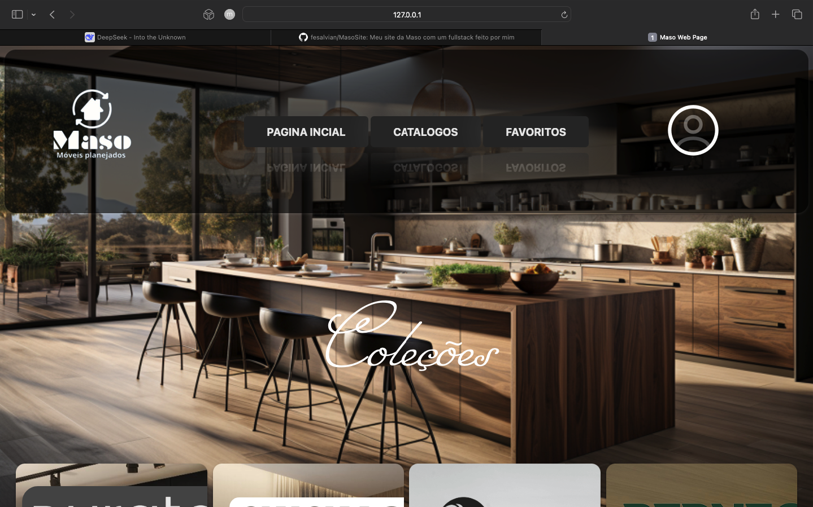
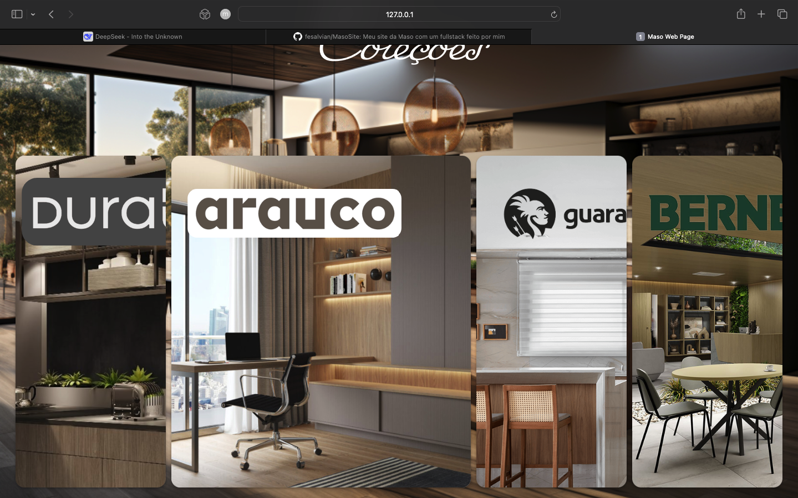
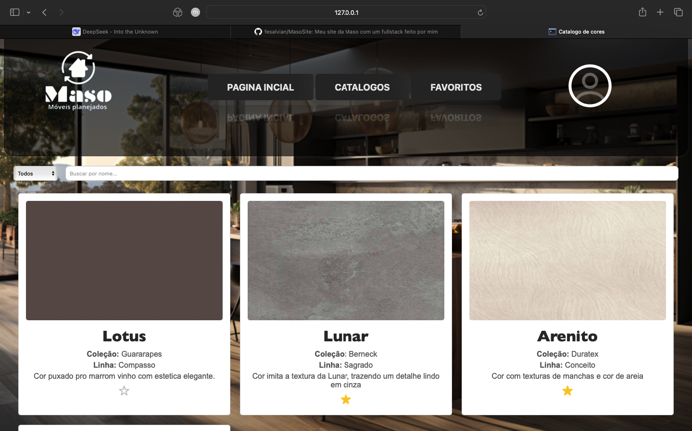
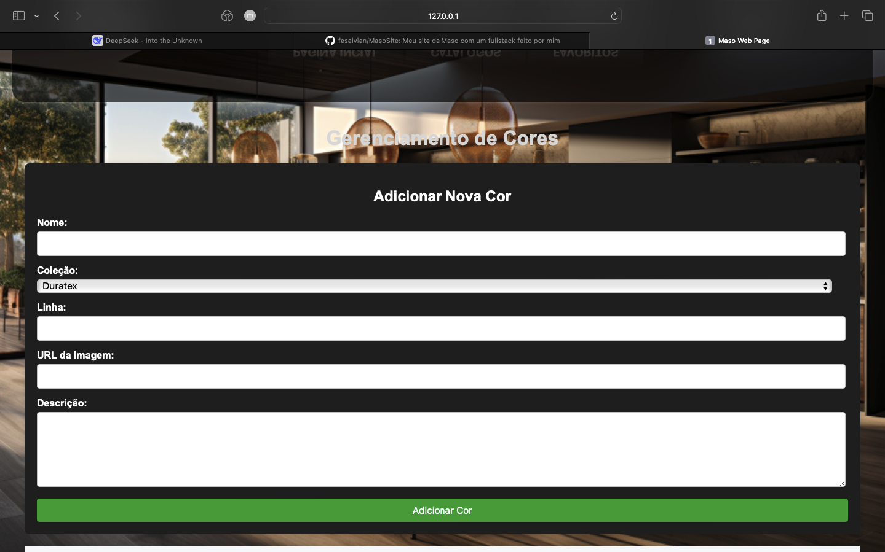
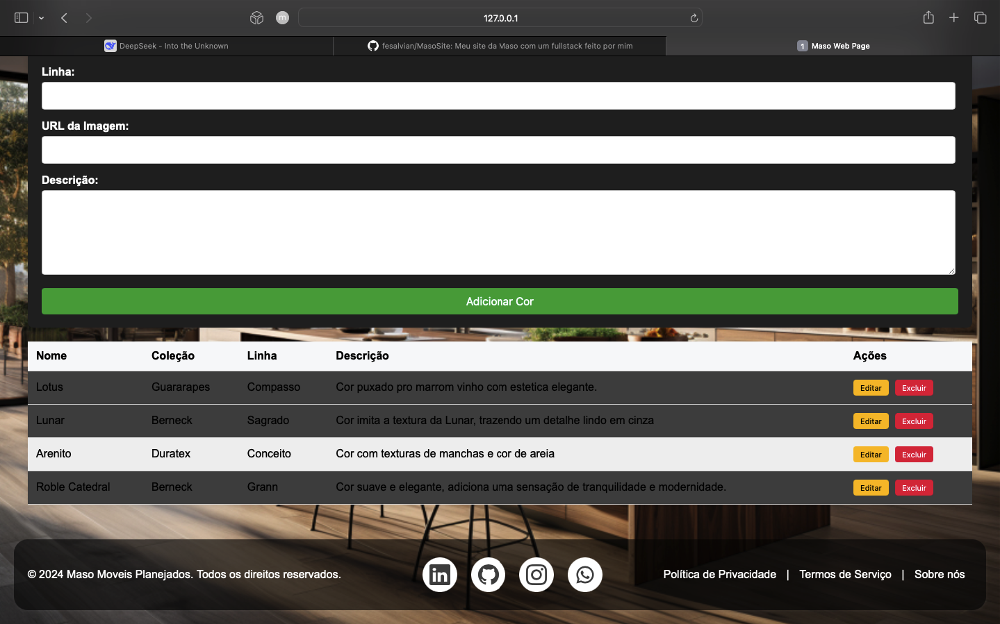
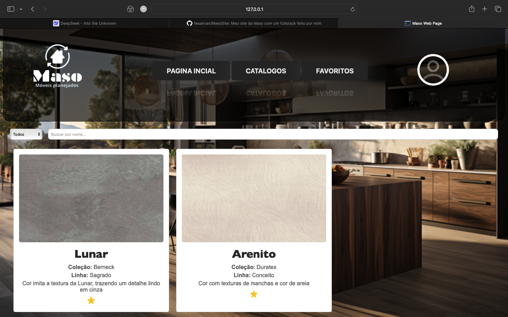

# MasoSite

Este é o repositório do projeto **MasoSite**, um site de catálogo de cores para móveis planejados. O site permite visualizar cores, filtrar por coleção, favoritar itens e gerenciar cores (CRUD) em uma área administrativa.

## 🚀 Funcionalidades

- **Catálogo de Cores**:
  - Visualize cores disponíveis.
  - Filtre cores por nome e coleção.
  - Favoritar cores para acesso rápido.

- **Área Administrativa**:
  - Adicionar novas cores.
  - Editar cores existentes.
  - Excluir cores.

- **Responsividade**:
  - Layout adaptável para dispositivos móveis e desktops.

- **Persistência de Dados**:
  - Favoritos salvos no `localStorage`.
  - Cores armazenadas em um banco de dados MySQL.

## 🛠️ Tecnologias Utilizadas

- **Frontend**:
  - HTML, CSS, JavaScript
  - Fetch API para comunicação com o backend

- **Backend**:
  - Flask (Python)
  - MySQL para armazenamento de dados

- **Outras Ferramentas**:
  - Git para controle de versão
  - Visual Studio Code como editor de código

## 📸 Screenshots

Aqui estão algumas imagens do projeto em funcionamento:

### Página Inicial




### Catálogo de Cores


### Área Administrativa (CRUD)




### Página de Favoritos



## 🚀 Como Rodar o Projeto

Siga os passos abaixo para configurar e rodar o projeto localmente.

### Pré-requisitos

- Python 3.x
- MySQL
- Git

### Passo a Passo

1. **Clone o repositório**:
   ```bash
   git clone https://github.com/fesalvian/MasoSite.git
   cd MasoSite
   ```

2. **Configure o ambiente virtual**:
   ```bash
   python -m venv venv
   source venv/bin/activate  # No Windows, use `venv\Scripts\activate`
   ```

3. **Instale as dependências**:
   ```bash
   pip install -r requirements.txt
   ```

4. **Configure o banco de dados**:
   - Crie um banco de dados MySQL chamado `MasoCatalogDB`.
   - Atualize as credenciais no arquivo `app.py`:
     ```python
     db_config = {
         'host': 'localhost',
         'user': 'seu_usuario',
         'password': 'sua_senha',
         'database': 'MasoCatalogDB'
     }
     ```

5. **Execute o backend**:
   ```bash
   python3 app.py
   ```

6. **Acesse o site**:
   - Abra o navegador e acesse `http://127.0.0.1:5000`.

## 📂 Estrutura do Projeto

```
MasoSite/
├── app.py                  # Backend Flask
├── requirements.txt        # Dependências do Python
├── static/                 # Arquivos estáticos (CSS, JS, imagens)
│   ├── css/
│   ├── js/
│   └── img/
├── templates/              # Templates HTML
│   ├── home.html
│   ├── catalogo.html
│   ├── favoritos.html
│   └── admin.html
├── screenshots/            # Screenshots do projeto
└── README.md               # Documentação do projeto
```

## 🤝 Como Contribuir

Contribuições são bem-vindas! Siga os passos abaixo:

1. Faça um fork do projeto.
2. Crie uma branch para sua feature (`git checkout -b feature/nova-feature`).
3. Commit suas alterações (`git commit -m 'Adiciona nova feature'`).
4. Push para a branch (`git push origin feature/nova-feature`).
5. Abra um Pull Request.


Feito com ❤️ por [Felipe Salvian](https://github.com/fesalvian).
